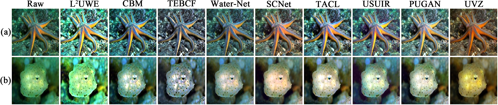
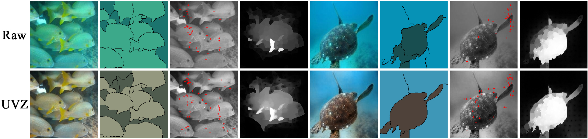

# UVZ
This is the project of paper "Underwater Variable Zoom: Depth-Guided Perception Network for Underwater Image Enhancement".

# Abstract 
Underwater scenes intrinsically involve degradation problems owing to heterogeneous ocean elements. Prevailing underwater image enhancement (UIE) methods stick to straightforward feature modeling to learn the mapping function, which leads to limited vision gain as it lacks more explicit physical cues (e.g., depth). In this work, we investigate injecting the depth prior into the deep UIE model for more precise scene enhancement capability. To this end, we present a novel depth-guided perception UIE framework, dubbed underwater variable zoom (UVZ). Specifically, UVZ resorts to a two-stage pipeline. First, a depth estimation network is designed to generate critical depth maps, combined with an auxiliary supervision network introduced to suppress estimation differences during training. Second, UVZ parses near-far scenarios by harnessing the predicted depth maps, enabling local and non-local perceiving in different regions. Extensive experiments on five benchmark datasets demonstrate that UVZ achieves superior visual gain and delivers promising quantitative metrics. Besides, UVZ is confirmed to exhibit good generalization in some visual tasks, especially in unusual lighting conditions.

# Comparison Figures
Here are some comparison figures of our method:  

  

  

 

# Discussion
The complete code and models will be made public soon
